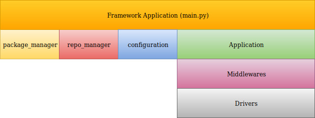

##################
Raspicar framework
##################

*******
Modules
*******

===============
package_manager
===============

This module is able to manage python packages to
dynamically update them before running the application
or the framework.
By default the object load the 'config.json' in the
package folder, but there is another option to load
custom config file.

===============
package_updater
===============

This module is able to manage repositories to
dynamically update them before running the application.
By default the object load the 'config.json' in the
package folder, but there is another option to load
custom config file.

************
Architecture
************

*******
License
*******

.. include:: LICENSE
